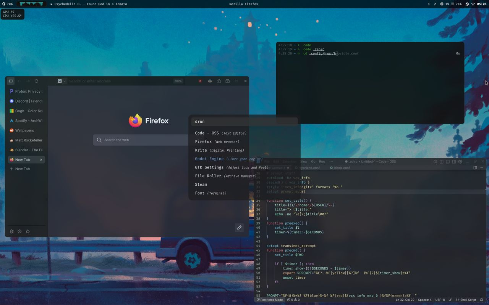

## some cool hyprland dotfiles



some packages you might need:
```
zsh
zsh-autosuggestions
zsh-history-substring-search
zsh-syntax-highlighting
materia-gtk-theme
ttf-fira-code
noto-fonts-cjk
noto-fonts-emoji
noto-fonts-extra
otf-font-awesome
hyprland
hypridle
hyprlock
hyprpaper
hyprshot
waybar
mako
cava
foot
rofi-wayland
rofi-emoji
wl-clip-persist
wtype
```
